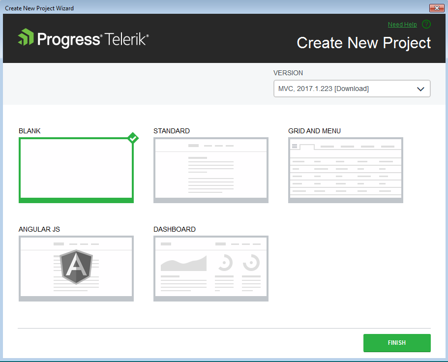

# Creating Kendo UI for jQuery Projects

This article demonstrates how to create a new Progress&reg; Kendo UI&reg; for jQuery application.

## Getting Started

### The Basics

New Progress&copy; Telerik&copy; Kendo UI for jQuery applications are created by using the **Create New Project Wizard**.

To start the **Create New Project Wizard**, follow either of the approaches below.

**Approach 1**

1. Go to the Telerik menu.
2. Click **Telerik** > **Kendo UI** > **Create New Kendo UI Project** .

**Approach 2**

1. Click **File** > **New** > **Project**.
2. Navigate to the Kendo UI ASP.NET MVC 5 project templates under **Telerik** > **Web**.

The wizard detects all the installed versions of Progress&reg; Telerik&reg; UI for ASP.NET MVC and lists them in the **Version** combobox. This enables you to select a version you want to apply to your project.

**Figure 1. New Kendo UI Project Wizard**

### Project Settings

The **Create New Project** page enables you to modify the project settings by configuring the following options:

* **Project type**&mdash;Choose the desired project type: **Empty**, **Standard**, **Grid and Menu**, **Angular JS**, or **Dashboard**.
* **Version**&mdash;Choose the version of Kendo UI you want to use.

### New Web Application Creation

After configuring the project settings, click **Finish** to start the creation of the new Kendo UI Professional application.

As a result, the wizard:
* Creates a new ASP.NET MVC application.
* Copies all Kendo UI scripts.
* Copies all Kendo UI content files.
* Adds references to required scripts in the master page.

## See Also

* [VS Integration Overview]()
* [Configure Projects]()
* [Upgrade Projects]()
* [Convert Projects]()
* [VS Extensions Options]()
* [Download New Versions]()
